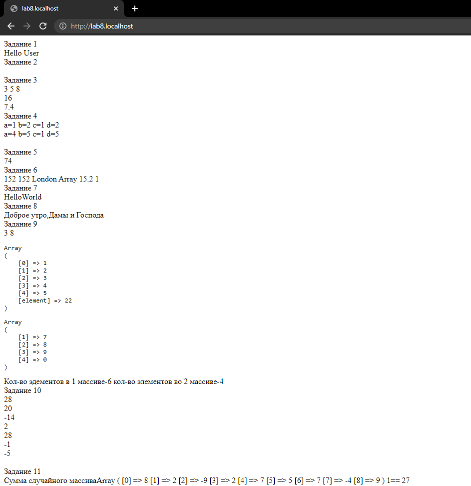
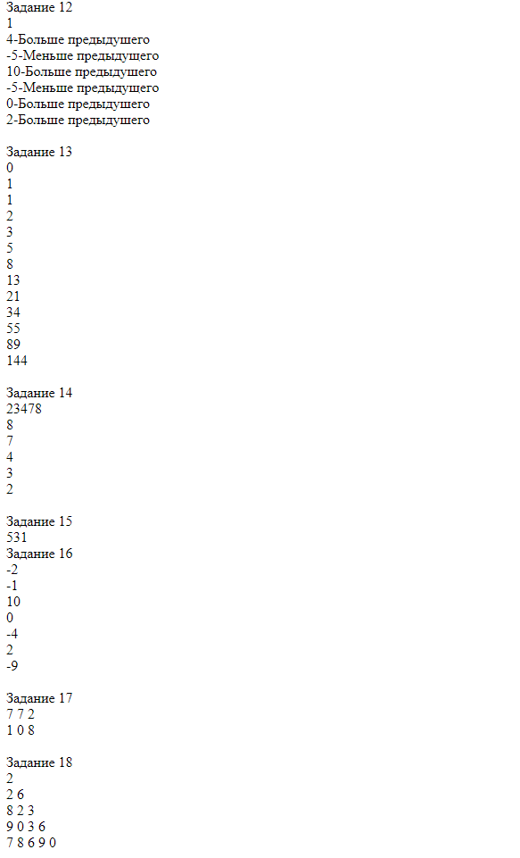
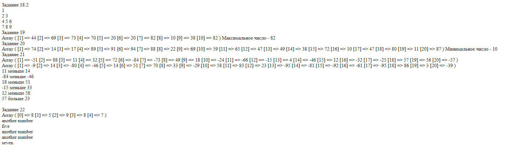

<h2 style="text-align: center; margin-top: 100px;font-size:40px">Лабораторная работа №8</h2>
<h2 style="text-align: center; margin-top:10px">Разработка серверных скриптов</h2>
<h3 style="text-align: right; margin-top:400px">Выполнил студент 3 курса   Чагочкин Никита</h3>
<h3 style="text-align: center; margin-top:40px">Южно-Сахалинск  2022 г. </h3>

- - -

## Решение:
    <?php 
    //Выполнил Чагочкин Никита
    /* 09
    11
    22*/
    function task1(){
        echo("Hello User");
    }

    function task2(){
        $TvShow;
        $ManufacturAddress;
        $CarColor;
        $WaterTemp;
        $PhoneModel;

    }

    function task3(){
        $Var1=3;
        $Var2=5;
        $Var3=8;
        echo $Var1," ",$Var2," ",$Var3," ";
        $sum=$Var1+$Var2+$Var3;
        echo $sum," ";
        echo 2+6+2/5-1;
    }
    function task4(){
        $a=1;
        $b=2;
        $c=$a;
        $d=&$b;
        echo "a=",$a," b=",$b," c=",$c," d=",$b," ";
        $a=4;
        $b=5;
        echo "a=",$a," b=",$b," c=",$c," d=",$b," ";
    }
    function task5(){
        define("A",41);
        define("B",33);
        echo A+B;
    }
    function task6(){
    $a = 152;
    $b = '152';
    $c = 'London'; 
    $d = array(152); 
    $e = 15.2;
    $f = false;
    $g = true;
    echo $a," ",$b," ",$c," ",$d," ",$e," ",$f," ",$g;
        
    }
    function task7(){
        $a="Hello";
        $b="World";
        echo $a.$b;
        
    }
    function task8(){
        $a="Доброе утро,";
        $b="Дамы и ";
        $c="Господа";
        echo $a.$b.$c;
        
    }
    function task9(){
        
    $array1=array(1,2,3,4,5);
    $array2=array(6,7,8,9,0);
    $array1[(element)]=22;
    unset($array2[0]);
    echo $array1[2],"        ",$array2[2];
    echo '<pre>';
    print_r($array1);
    echo '</pre>';
    echo '<pre>';
    print_r($array2);
    echo '</pre>';
    echo "Кол-во эдементов в 1 массиве-",count($array1)," кол-во элементов во 2 массиве-",count($array2);
        
    }
    function task10(){
    $n=7;
    for ($x = 0; $x < $n; $x++) {
    echo rand(-21,35)," ";
    }  
        
    }
    function task11(){
    $n=9;
    $arr=array();;
    $sum=0;
    for ($x = 0; $x < $n; $x++) {
        $temp=rand(-10,10);
        array_push($arr,$temp);
        $sum+=$temp;
    }   
    echo "Сумма случайного массива",print_r($arr),"== ",$sum;
    }
    function task12(){
    $n=7;
    $arr=array();
    $str="";
    for ($x = 0; $x < $n; $x++) {
        $temp=rand(-10,10);
        array_push($arr,$temp);
        if($x>0&&$temp>$arr[$x-1]){
            $str="-Больше предыдушего";
        }
        if($x>0&&$temp<$arr[$x-1]){
            $str="-Меньше предыдущего";
        }
        if($x==0 || $temp==$arr[$x-1]){
            $str="";
        }
        echo $temp,$str," ";
    }
    }
    function task13(){
    $N = 10;
    $arr = array();
    $arr[0] = 0;
    $arr[1] = 1;
    for($i = 0; $i <= $N; $i++)
    {
        $arr[$i+2] = $arr[$i] + $arr[$i+1];
    }     
    foreach( $arr as $value )
        echo $value . ' ';  
        
    }
    function task14(){ 
    $num=23478;
    echo $num," ";
    $del = 10;
    $amountNum = mb_strlen($num); 
    while($amountNum > 0) {
        echo $num % $del, " ";
        $num /= 10; 
        $amountNum--;
    }
    }
    function task15(){ 
    $n=12345;
    $c = 0;
        do { 
            $a = $n%10;
            $b = $a%2;
            if ($b > 0) {
                $c = $a;
                echo $c;
            } 
            $n = bcdiv ($n, 10, 0); 
        }   
        while ($n > 0);
        if ($c == 0) {
                echo 'Нечетных цифр не обнаружено!';
        }
    }
    function task16(){ 
    $arr=array();
    for ($x = 0; $x < 7; $x++) {
        $temp=rand(-10,10);
        array_push($arr,$temp);
    }
    for ($x = 0; $x < 7; $x++){
        echo $arr[$x]," ";
    }
    }
    function task17(){
    define("M", 2);
    define("N", 3);
    for($a = 0; $a < M; $a++) {
        for($b = 0; $b < N; $b++) {
            $arrays[$a][$b] = rand(0,9);
        } 
    }
    foreach($arrays as $a) {
        foreach($a as $b) { 
            echo $b, ' ';
        }
        echo " ";
    }
    }

    function task18(){
    $size=15;
    $array = [];    
    for ($i = 0; $i < $size; $i++) {
        $array[$i] = rand(0, 9);
    }
    $j = 1;
    $t = 0;
    for ($i = 0; $i < count($array); $i++) {      
        echo $array[$i] . ' ';
        $t++;
        if ($t == $j) {
            echo ' ';
            $t = 0;
            $j++;
        }
    }
    }

    function task18_2(){
    $n=9; 
    $j = 1;
    $t = 0;
    for ($i = 1; $i <= $n; $i++) { 
        echo $i . ' ';
        $t++;
        if ($t == $j) {
            echo ' ';
            $t = 0;
            $j++;   
        }    
    }  
    }
    function task19(){
    $n=10;
    $array = [];
    for ($d = 1; $d <= $n; $d++) {
        $array[$d] = random_int(1, 100);
    }
    print_r($array);
    $max_arg = $array[1];
    for ($d = 2; $d <= count($array); $d++) {
        if ($array[$d] > $max_arg) {
            $max_arg = $array[$d];
        }   
    }
    echo "Максимальное число - ", $max_arg;
    }
    function task20(){
    $n=20;
    $array = [];
    for ($d = 1; $d <= $n; $d++) {
        $array[$d] = random_int(1, 100);
    }
    print_r($array);
    $min_arg = $array[1];
    for ($d = 2; $d <= count($array); $d++) {
        if ($array[$d] < $min_arg) {
            $min_arg = $array[$d];
        }   
    }
    echo "Минимальное число - ", $min_arg;
    }
    function task21(){
    $firstArray=[];
    $secondArray=[];
    for($a = 1; $a <= 20; $a++) {
        $secondArray[$a] = rand(-99, 99);
    }
    for($a = 1; $a <= 20; $a++) {
        $firstArray[$a] = rand(-99, 99);
    }
    print_r($firstArray);
    echo " ";
    print_r($secondArray);
    echo " ";
    $keyOfFirstArray = 3;
    $keyOfSecondArray = 2;
    $amountElements = count($firstArray);
        
    while($keyOfFirstArray <= $amountElements) { 
        $elemA = $firstArray[$keyOfFirstArray];
        $elemB = $secondArray[$keyOfSecondArray];
            
        if($elemA > $elemB) {
            echo "$elemA больше $elemB ";
        }
        elseif($elemA < $elemB) {
            echo "$elemA меньше $elemB ";
        }
        else {
            echo "$elemA равно $elemB ";
        }
        $keyOfFirstArray += 3; 
        $keyOfSecondArray += 2; 
    }
    }
    function task22(){
    $n=5;
    $arr = [];
    for ($i = 0; $i < $n; $i++) {
        $arr[$i] = rand(5, 12);                             
    }
    print_r($arr);
    echo " ";
    foreach ($arr as $value) {
        switch ($value) {
            case 5:
                echo "five", " ";
                break;
            case 6:
                echo "six", " ";
                break;
            case 7:
                echo "seven", " ";
                break;
            default:
                echo "another number", " ";                
                break;
            }
    }
    }
    echo "Задание 1 "." ";
    task1();
    echo " "."Задание 2 "." ";
    task2();
    echo " "."Задание 3 "." ";
    task3();
    echo " "."Задание 4 "." ";
    task4();
    echo " "."Задание 5 "." ";
    task5();
    echo " "."Задание 6 "." ";
    task6();
    echo " "."Задание 7 "." ";
    task7();
    echo " "."Задание 8 "." ";
    task8();
    echo " "."Задание 9 "." ";
    task9();
    echo " "."Задание 10 "." ";
    task10();
    echo " "."Задание 11 "." ";
    task11();
    echo " "."Задание 12 "." ";
    task12();
    echo " "."Задание 13 "." ";
    task13();
    echo " "."Задание 14 "." ";
    task14();
    echo " "."Задание 15 "." ";
    task15();
    echo " "."Задание 16 "." ";
    task16();
    echo " "."Задание 17 "." ";
    task17();
    echo " "."Задание 18 "." ";
    task18();
    echo " "."Задание 18.2 "." ";
    task18_2();
    echo " "."Задание 19 "." ";
    task19();
    echo " "."Задание 20 "." ";
    task20();
    echo " "."Задание 21 "." ";
    task21();
    echo " "."Задание 22 "." ";
    task22();
    ?>   
- - -
